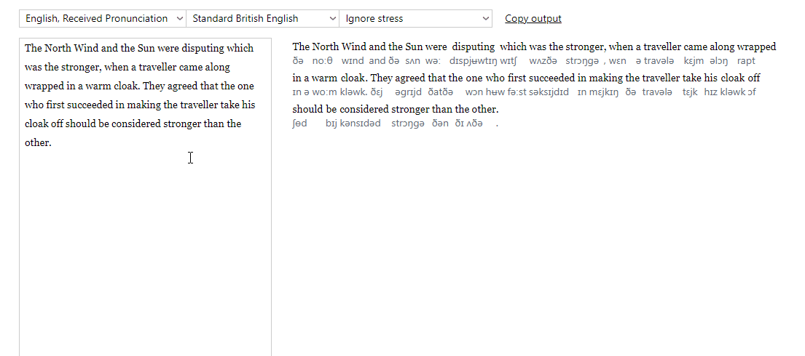

# Vymover

This is a fun little tool inspired by the great book _English After RP_. It displays the output of [eSpeak NG](https://github.com/espeak-ng/espeak-ng), with some additional rules to make the IPA correspond to a more modern version of English.

The whole thing is a quick hack, please don't expect too much.

To use, install `espeak`. If you're not using Windows, you'll probably need to change `C:\Program Files\eSpeak NG\espeak-ng` in `lib2.py` to sth else, idk. After installing `requirements.txt` you should be able to run `app.py` as a regular Flask app.
